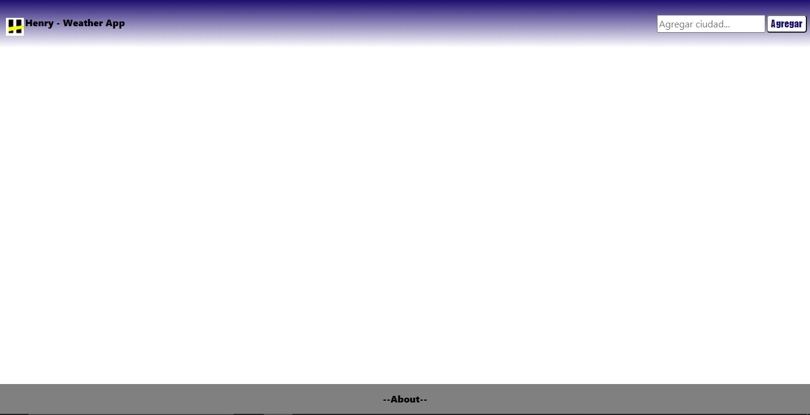

#  Weather App


Aplicación creada 100% con __React.js__ de forma individual, donde usando la _API_ de https://openweathermap.org/api logramos buscar las ciudades deseadas atreves de un __SearchBar__, tambien permite acceder a informacion mas detallada haciendo _"click"_ sobre el nombre de la ciudad. implementando _react-router-dom_ logramos una navegación limpia sin tener que recargar la pagina en ningun momento(SPA).

## PRUEBA 


Sientase completamente libre de ver mi aplicación para esto es necesario:
 

```NPM
npm install
```

```NPM
npm start
```

### Inicio

lo que vera a continuacion es que en su navegador se abrira una pestaña en _"http://localhost:3000/"_ y podra ver la home de __Weather App__. 




### Buscar

Para visualizar las cards con información del clima debera realizar una busqueda de la ciudad deseada en la esquina superior derecha, tan solo al darle __"ENTER"__, la información del clima se muestra sin demoras en su pantalla. Las cards se acomodan segun la cantidad de busquedas que realize y el diseño es responsive.


### Detalles

Por ultimo usted podra ver los detalles de su ciudad con un simple __"click"__ en el nombre de la misma


